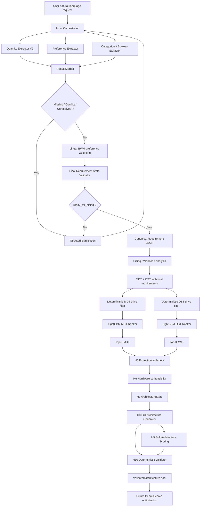

# Explainable Lustre File System Recommender

Système hybride, déterministe et explicable de recommandation d’architectures **Lustre** pour environnements HPC.

Le projet transforme une demande utilisateur exprimée en langage naturel en un **Requirement State structuré**, applique un **sizing Lustre**, filtre et classe les candidats matériels MDT/OST, puis construit et valide des architectures physiques complètes selon des contraintes déterministes.

> Principe central : **l’IA aide à comprendre et à classer ; elle ne remplace jamais les contraintes physiques ni les validateurs déterministes.**

---

## 1. État actuel du projet

État consolidé au **28 août 2026**.

| Bloc | Statut | Résultat principal |
|---|---|---|
| Quantity Requirement Extractor V2 | ✅ Validé | 96/96 régressions, aucune acceptation automatique fausse observée |
| Preference Signal Detector | ✅ Frozen | DistilBERT multilingue, garde haute précision |
| Preference Layer 2 | ✅ Frozen | XLM-R + 8 têtes + garde déterministe + fallback résiduel |
| Preference Weighting | ✅ Frozen | Linear Best-Worst Method (BWM) |
| Categorical / Boolean Extractor | ✅ Frozen | XLM-R partagé pour `ha_required` et `access_type` |
| Input Orchestrator | ✅ Validé | clarification stricte, conflits, multi-tour, BWM |
| Final Requirement State | ✅ Validé | JSON canonique + validation déterministe |
| Production online `main.py` | 🚧 En validation manuelle finale | 38 tests orchestrateur + 21 tests Requirement State |
| Sizing Lustre | ✅ Frozen S10 | formule de croissance composée + registre d’hypothèses + validation Toubkal |
| MDT / OST technical requirements | ✅ Validé | génération sur 1200/1200 cas |
| Deterministic drive filtering | ✅ Validé | contraintes appliquées avant ML |
| MDT / OST ranking | ✅ Frozen | LightGBM LambdaRank officiel pour MDT et OST |
| Top-K MDT / OST | ✅ Intégré | candidats classés après filtrage déterministe |
| H5 protection arithmetic | ✅ Validé | calcul des variantes de protection et des nombres physiques |
| H6 hardware compatibility | ✅ Validé | chemins serveur/contrôleur/enclosure/network/HA |
| H7 `ArchitectureState` | ✅ Validé | transitions et agrégations déterministes |
| H8 Full Architecture Generator | ✅ Validé | architectures physiques complètes générées |
| H9 Architecture Scoring | ✅ Validé | score soft indépendant des contraintes dures |
| H10 Full Architecture Validator | ✅ Validé | validation déterministe indépendante du score |
| Feasibility coverage | ✅ Évaluée | 1090/1200 cas confirmés faisables après H10-C à K=10 |
| Beam Search | ⏳ Couche suivante | non utilisé par H8/H9/H10 ; doit seulement optimiser l’exploration |

### Point important sur le mot “architecture finale”

Le projet sait déjà **générer des architectures physiques complètes et les valider avec H10**.

Le **Beam Search n’est pas nécessaire pour définir la validité physique**. Il doit être ajouté ensuite comme mécanisme d’optimisation de recherche pour éviter d’explorer exhaustivement trop de combinaisons. Une architecture ne devient jamais valide parce que son score Beam est élevé : seul le validateur H10 peut la déclarer valide.

---

# 2. Vue d’ensemble du pipeline



---

# 3. Deux pipelines différents : offline et online

## 3.1 Pipeline offline

Le pipeline offline sert à construire, entraîner et valider les composants.

```text
datasets
   ↓
training / calibration
   ↓
frozen model artifacts
   ↓
evaluation
   ↓
runtime artifacts
```

Il contient notamment :

- entraînement du Semantic Linker ;
- entraînement du Preference Signal Detector ;
- entraînement du Preference Layer 2 ;
- entraînement du modèle categorical/boolean ;
- génération des datasets MDT / OST ;
- comparaison CatBoost / LightGBM ;
- entraînement des rankers LightGBM officiels ;
- campagnes de validation sizing et architecture.

**Il ne doit pas être relancé à chaque requête utilisateur.**

## 3.2 Pipeline online

Le pipeline online charge les modèles déjà entraînés.

```text
user text
   ↓
extraction
   ↓
clarification
   ↓
BWM
   ↓
Final Requirement JSON
   ↓
sizing
   ↓
filtering
   ↓
ranking
   ↓
architecture generation / validation
```

Le point d’entrée actuel pour la partie online Requirement est :

```powershell
python main.py --device cpu
```

Le fichier produit est :

```text
output/final_requirement.json
```

---

# 4. Requirement Contract final

Le contrat canonique contient **18 champs bruts**.

```text
requested_usable_capacity_tib
client_count
average_file_size_gb
max_file_size_gb
total_file_count
read_write_ratio
access_type
target_read_gbps
target_write_gbps
ha_required
max_budget_usd
max_power_w
annual_growth_percent
planning_horizon_years
cost_priority
power_priority
reliability_priority
performance_priority
```

Un objet dérivé séparé contient les poids :

```json
{
  "preference_weights": {
    "cost": 0.0,
    "power": 0.0,
    "performance": 0.25,
    "reliability": 0.75
  }
}
```

Les poids BWM **ne remplacent jamais** les labels qualitatifs `LOW`, `MEDIUM`, `HIGH`, etc.

Exemple :

```json
{
  "requested_usable_capacity_tib": 100,
  "client_count": 64,
  "average_file_size_gb": null,
  "max_file_size_gb": null,
  "total_file_count": null,
  "read_write_ratio": {
    "read_percent": 20.0,
    "write_percent": 80.0
  },
  "access_type": "sequential",
  "target_read_gbps": 20,
  "target_write_gbps": 22,
  "ha_required": true,
  "max_budget_usd": 5000,
  "max_power_w": 20000000,
  "annual_growth_percent": 20,
  "planning_horizon_years": 3,
  "cost_priority": "HIGH",
  "power_priority": "LOW",
  "reliability_priority": "HIGH",
  "performance_priority": "HIGH",
  "preference_weights": {
    "cost": 0.0,
    "power": 0.0,
    "performance": 0.25,
    "reliability": 0.75
  }
}
```

---

# 5. Quantity Requirement Extractor V2

Production package :

```text
requirement_extractor_v2/
```

L’ancien dossier :

```text
requirement_extractor/
```

est conservé pour historique/compatibilité, mais la nouvelle architecture de production est basée sur **Requirement Extractor V2**.

## 5.1 Pipeline

```text
ConversationScopeResolver
        ↓
QuantityScanner
        ↓
Robust Explicit Resolver
        ↓ unresolved only
Semantic Linker XLM-R
        ↓ abstention only
Qwen LLM fallback
        ↓
CandidateRelationResolver
        ↓
RelationAwareDeterministicVerifier
```

Fichiers principaux :

```text
requirement_extractor_v2/
├── verified_pipeline.py
├── selective_cascade.py
├── robust_quantity_scanner.py
├── robust_explicit_pattern_resolver.py
├── candidate_relation_resolver.py
├── relation_aware_verifier.py
├── deterministic_verifier.py
├── llm_fallback_extractor.py
├── unit_normalizer.py
└── semantic_linker/
```

## 5.2 Semantic Linker

Le Semantic Linker utilise **XLM-R** avec :

- une tête FIELD ;
- une tête ROLE ;
- calibration hiérarchique ;
- masque de compatibilité ;
- garde de sécurité déterministe ;
- abstention autorisée.

Artifact :

```text
requirement_extractor_v2/artifacts/semantic_linker_xlmr_base_final/
```

Le runtime vérifie notamment :

```text
encoder/
tokenizer/
classifier_heads.pt
labels.json
compatibility.json
thresholds.json
training_config.json
```

## 5.3 Gestion des relations entre valeurs

`CandidateRelationResolver` distingue notamment :

```text
SINGLE_VALUE
MULTIPLE_FIELDS
ALTERNATIVE
RANGE
CORRECTION
COMPARISON
CONFLICT
```

Une alternative ou un conflit ambigu n’est jamais converti automatiquement en une valeur arbitraire.

## 5.4 LLM fallback

Modèle local :

```text
qwen2.5-coder:7b
```

Le LLM :

- ne modifie pas la quantité détectée ;
- ne remplace pas la valeur numérique ;
- ne crée pas une unité ;
- ne devient jamais source autoritaire ;
- peut seulement résoudre FIELD/ROLE ou s’abstenir ;
- doit fournir une évidence issue du texte utilisateur.

Validation de référence :

- 96/96 scénarios de régression après correction ;
- 94 vrais positifs observés dans ce jeu ;
- 0 faux positif ;
- 8/8 ambiguïtés bloquées ;
- 8/8 cas hors scope correctement gérés ;
- 0 fausse acceptation automatique ;
- sous-ensemble fallback : 3/3 cas récupérables résolus ;
- 20/20 cas sans unité ont correctement conduit à l’abstention.

> Le jeu de 96 scénarios est une **suite de régression après inspection**, pas un benchmark indépendant totalement aveugle.

---

# 6. Preference Extractor

Production package :

```text
preference_extractor/
```

Le traitement des préférences est séparé en plusieurs couches.

## 6.1 Layer 1 — Preference Signal Detector

But :

```text
Le message contient-il un signal de préférence ?
```

Modèle :

```text
multilingual DistilBERT
```

Artifact :

```text
preference_signal_detector_v2_2.zip
```

Le fichier est suivi avec Git LFS.

Threshold frozen :

```text
0.00039663209463469684
```

Validation finale contrôlée :

```text
1200 cas
precision = 1.0
recall ≈ 0.99833
F1 ≈ 0.99917
FP = 0
FN = 1
```

Cette campagne est synthétique/contrôlée et doit être présentée comme telle.

## 6.2 Layer 2 — Preference dimension + intensity

Architecture :

```text
XLM-R Base shared encoder
        ↓
4 presence heads
+
4 ordinal intensity heads
```

Dimensions :

```text
cost
power
performance
reliability
```

Labels :

```text
NO_SIGNAL
VERY_LOW
LOW
MEDIUM
HIGH
VERY_HIGH
```

`NO_SIGNAL` est distinct de `VERY_LOW`.

Artifact frozen :

```text
preference_layer2_xlmr_v1_FINAL.zip
```

SHA256 :

```text
cdbb6f6544d4b4d96578e0901a00f46c68916ad66547800ffc4d232095298890
```

Pipeline hybride :

```text
raw XLM-R
   ↓
deterministic semantic guard
   ↓
residual validator
   ↓ only residual cases
Qwen fallback
```

Prompt frozen SHA256 :

```text
04e60847fc4739e3ece178cbc2c37fefabd1854314a457636747cfcd535df137
```

Validation du sous-ensemble hybride de calibration :

```text
331 / 335 exact
≈ 98.806 %
accepted precision = 1.0
false acceptance = 0
```

> Le TEST complet a montré que le résiduel LLM reste plus faible que le sous-ensemble de validation. Cette limite doit rester explicitement documentée ; le modèle n’a pas été réentraîné uniquement pour améliorer un smoke test.

## 6.3 Formal Preference Weighting — Linear BWM

Package :

```text
preference_extractor/weighting/
```

Méthode :

```text
Linear Best-Worst Method
```

Le système ne fait **jamais** :

```text
HIGH -> 0.8
MEDIUM -> 0.5
LOW -> 0.2
```

Les labels qualitatifs servent à déterminer les préférences actives, puis le système demande les comparaisons BWM nécessaires.

Nombre exact de questions pour `n` critères actifs :

```text
2n - 3
```

Exemple :

```text
cost        = 0.00
power       = 0.00
performance = 0.25
reliability = 0.75
sum         = 1.00
```

Tests :

```text
16 passed
```

Contrats :

- poids finis ;
- poids non négatifs ;
- somme = 1 ;
- critère inactif => poids 0 ;
- `xi_star` conservé ;
- cohérence ordinale vérifiée ;
- aucun poids numérique inventé par le LLM.

---

# 7. Categorical / Boolean Extractor

Package :

```text
categorical_boolean_extractor/
```

Deux sorties :

```text
ha_required
access_type
```

Architecture :

```text
Explicit Resolver
      ↓
shared XLM-R Base
      ↓
HA 4-class head
+
Access 4-class head
      ↓
class-specific confidence gate
      ↓ abstention only
Qwen fallback
      ↓
final semantic validator
```

Classes HA :

```text
HA_REQUIRED
HA_NOT_REQUIRED
HA_MENTION_NO_COMMITMENT
HA_NO_EVIDENCE
```

Classes access :

```text
SEQUENTIAL
RANDOM
MIXED
NO_SUPPORTED_ACCESS_CLASS
```

`UNRESOLVED` est un état de sortie de la confidence gate, pas une classe d’entraînement.

Artifact :

```text
categorical_boolean_extractor/artifacts/categorical_boolean_xlmr_v1_FROZEN.zip
```

SHA256 :

```text
fcda293810e1ca735ea1744b8278a2f41dc1be8b2cdb1c4c10c3ebc66da11ff3
```

Validation TEST contrôlée :

```text
HA accepted     = 5994 / 6000
Access accepted = 5996 / 6000
accepted precision = 1.0
```

Le final holdout est resté intact pendant la phase de freeze.

---

# 8. Input Orchestrator

Package local actuel :

```text
input_orchestrator/
```

Le rôle de l’orchestrateur n’est pas d’extraire lui-même des valeurs.

Il :

- reçoit les messages ;
- connaît la question active ;
- route vers les extracteurs ;
- fusionne les observations ;
- conserve l’état multi-tour ;
- gère les conflits ;
- choisit une seule clarification ciblée ;
- lance le dialogue BWM ;
- empêche l’accès à la validation finale tant que le contrat n’est pas complet.

États conversationnels :

```text
COLLECTING
WAITING_FOR_ANSWER
RESOLVING_CONFLICT
BWM_ELICITATION
READY_FOR_FINAL_VALIDATION
```

Règle de priorité :

```text
CONFLICT
  >
UNRESOLVED / MISSING
  >
BWM
  >
READY_FOR_FINAL_VALIDATION
```

Les champs optionnels peuvent devenir :

```text
DECLINED
```

si l’utilisateur répond par exemple :

```text
skip
```

Un champ requis ne peut pas être rendu prêt uniquement par `skip`.

Cas conditionnel important :

```text
annual_growth_percent > 0
```

implique :

```text
planning_horizon_years = VERIFIED
```

---

# 9. Final Requirement State

Package :

```text
requirement_state/
```

Responsabilités :

```text
WorkingSessionState
        ↓
RequirementStateBuilder
        ↓
FinalRequirementState
        ↓
DeterministicRequirementValidator
        ↓
ready_for_sizing
```

Le validateur final contrôle notamment :

- aucun champ requis non résolu ;
- aucun `CONFLICT` ;
- aucun `UNRESOLVED` ;
- nombres finis ;
- valeurs positives/non négatives selon le champ ;
- `average_file_size_gb <= max_file_size_gb` ;
- croissance > 0 => horizon requis ;
- structure correcte du read/write ratio ;
- `read_percent + write_percent = 100` ;
- `access_type` canonique ;
- `ha_required` booléen ;
- labels de préférence canoniques ;
- poids BWM finis/non négatifs ;
- somme des poids = 1 ;
- poids nul pour critères inactifs ;
- cohérence BWM = PASS.

La sortie n’est transmise au sizing que si :

```text
ready_for_sizing = true
```

---

# 10. Production Online Main

Point d’entrée :

```text
main.py
```

Commande :

```powershell
python main.py --device cpu
```

Le LLM fallback est activé par défaut.

Le launcher :

1. vérifie les artifacts ;
2. vérifie Ollama ;
3. vérifie `qwen2.5-coder:7b` ;
4. démarre le dialogue ;
5. charge Quantity / Preference / Categorical ;
6. demande les clarifications ;
7. lance BWM ;
8. lance la validation finale ;
9. revient vers l’utilisateur si la validation trouve une contradiction ;
10. écrit le JSON final.

Exemple de correction automatique de flux :

```text
average_file_size_gb = 20
max_file_size_gb = 1
```

ne doit pas faire terminer le processus.

La production doit revenir avec une question du type :

```text
Please enter a corrected maximum file size >= 20 GB.
```

Le JSON final est écrit dans :

```text
output/final_requirement.json
```

Tests actuels du nouveau launcher / orchestration :

```text
input_orchestrator : 38 passed
requirement_state  : 21 passed
```

Le dernier test manuel a confirmé :

- Ollama prêt ;
- fallback global activé ;
- `20/80` converti en structure `{read_percent, write_percent}` ;
- `"not important"` lié à `power_priority=LOW` sans créer un faux conflit HA ;
- erreur `average > max` détectée et transformée en clarification.

La validation manuelle finale de cette nouvelle boucle doit être terminée jusqu’à :

```text
STATUS: PRODUCTION_ONLINE_PIPELINE_COMPLETE
```

avant de considérer ce launcher frozen.

---

# 11. Sizing Lustre — Frozen S10

Le sizing est documenté dans :

```text
lustre_architecture_generator/evaluation/sizing/
```

Document principal :

```text
sizing_formula_spec.md
```

## 11.1 Capacité planifiée

Formule frozen :

```text
planned_usable_capacity_tib
=
requested_usable_capacity_tib
*
(1 + annual_growth_percent / 100)^planning_horizon_years
/
target_fill_ratio
```

Default :

```text
target_fill_ratio = 0.8
```

Exemple de référence :

```text
requested capacity = 100 TiB
growth             = 20 %
horizon            = 3 years
fill ratio         = 0.8

planned capacity   = 216 TiB
```

Il n’existe plus de fallback production pour l’horizon.

`planning_horizon_years` doit être :

```text
finite
integer
> 0
```

## 11.2 Workload classification

Metadata score :

```text
0.5 * file_count_score
+ 0.3 * small_file_factor
+ 0.2 * client_count_score
```

Data score :

```text
0.4 * capacity_score
+ 0.4 * bandwidth_score
+ 0.2 * large_file_factor
```

Marge de dominance :

```text
0.15
```

## 11.3 MDT IOPS sizing

```text
raw_iops
=
base_iops_per_client
* client_count
* file_size_multiplier
* access_multiplier
* metadata_pressure_multiplier
```

Puis :

```text
required_total_iops
=
ceil(raw_iops * iops_safety_factor)
```

Valeurs frozen :

```text
base IOPS/client       = 100
file-size multipliers  = 3.0 / 1.5 / 1.0
access multipliers     = 1.4 / 1.15 / 1.0
metadata multipliers   = 1.5 / 1.2 / 1.0
IOPS safety factor     = 1.25
```

## 11.4 MDT metadata capacity

```text
required_metadata_capacity_tib
=
file_count
* 4096
* 2.0
/ 1024^4
```

## 11.5 OST throughput sizing

```text
required_read_bandwidth
=
target_read_bandwidth * 1.25

required_write_bandwidth
=
target_write_bandwidth * 1.25
```

Le `1.25` est le facteur calibré final.

## 11.6 Assumption Registry

Le freeze S10 impose :

```text
architecture_rules.json version = 2.0
23 registered assumptions with final status
```

Statuts possibles :

```text
SUPPORTED
CALIBRATED
POLICY_CHOICE
NEEDS_REVISION
```

Artefacts :

```text
sizing_assumptions.json
calibration_decisions.json
sizing_formula_spec.md
sensitivity_analysis.md
```

---

# 12. Validation Toubkal du sizing

Le sizing a été confronté à des expériences MDTest / IOR sur Toubkal.

Scope terminé :

```text
M1 – M5 validés
M6 sequential validé
M6 shuffled validé
```

Observation M5 mixed :

```text
create ≈ 4893 ops/s
stat   ≈ 4790 ops/s
remove ≈ 7765 ops/s
IOR write ≈ 355 MiB/s
IOR read  ≈ 1208 MiB/s
```

Le facteur OST final `1.25` a été calibré à partir de la contention observée.

Limitation connue :

```text
M6-C random-overlap
```

échoue avec IOR 4.1.0+dev à cause d’une division par zéro. Cette limitation doit rester documentée ; elle ne doit pas être masquée.

---

# 13. Architecture Generator — MDT / OST technical requirements

Package :

```text
lustre_architecture_generator/
```

Principaux fichiers :

```text
src/workload_analyzer.py
src/feature_calculator.py
src/architecture_generator.py
src/mdt_candidate_generator.py
src/ost_candidate_generator.py
src/training_dataset_builder.py
```

`architecture_generator.py` produit des **exigences techniques MDT/OST indépendantes du matériel**.

Il ne choisit pas encore, à cette étape :

```text
drive
RAID
target count
server
stripe
```

Commande :

```powershell
python lustre_architecture_generator\src\architecture_generator.py
```

Dernier run manuel observé :

```text
Cas chargés              : 1200
Architectures générées   : 1200

MDT priority
low       959
medium    235
high        4
critical    2

OST priority
low       604
medium    273
high      282
critical   41

MDT IOPS
min      = 2750
mean     ≈ 678410.07
max      = 7715138

OST bandwidth
min      = 31.25
mean     ≈ 500.74
max      = 3307.50 GB/s
```

Output :

```text
lustre_architecture_generator/output/lustre_architecture_dataset.json
```

---

# 14. Correction importante des unités OST

Le contrat historique utilise des noms de champs terminant par :

```text
_gbps
```

mais la convention métier du projet représente actuellement ces valeurs en :

```text
GB/s
```

La conversion catalogue correcte est :

```text
GB/s = MB/s / 1000
```

et non :

```text
Gb/s = MB/s * 0.008
```

Après correction :

- les datasets OST ont été régénérés ;
- les anciens modèles OST ont été invalidés ;
- les rankers ont été réentraînés.

Impact observé sur 1200 cas :

```text
Top-10 changed : 834 / 1200
Top-1 changed  : 466 / 1200
drive count changed : 480 / 1200
```

---

# 15. Deterministic drive filtering

Avant le ranking, tous les candidats passent par les contraintes dures.

Principe :

```text
hardware catalog
      ↓
deterministic feasibility
      ↓
feasible candidates only
      ↓
ML ranking
```

Le ML ne peut jamais récupérer un candidat éliminé pour non-faisabilité.

Le runtime officiel garantit :

```text
hard_constraints_applied_before_model = true
all_feasible_candidates_ranked_before_top_k = true
```

Le ranking reste un ranking **pre-RAID drive selection**.

---

# 16. Datasets MDT / OST de ranking

Datasets finaux régénérés :

## MDT

```text
rows = 188,412
train cases = 840
validation cases = 180
test cases = 180
```

SHA256 dataset non compressé :

```text
a6dbcb1ae8c446f626a05d1f8393500a8ee77292770baf6e6ce10dc5824b273c
```

## OST

```text
rows = 116,572
train cases = 840
validation cases = 180
test cases = 180
```

SHA256 dataset non compressé :

```text
28380ba8e4ae5d988da834b5d74bce6bd3062d2a948cdece3710227ae51fd2b2
```

> Les labels sont issus d’un **teacher déterministe synthétique**. Les métriques mesurent donc principalement la capacité du ranker à reproduire ce teacher, et non une vérité terrain universelle issue de clusters Lustre réels.

---

# 17. Rankers officiels — LightGBM LambdaRank

Après comparaison CatBoost / LightGBM, **LightGBM** a été retenu pour MDT et OST.

Runtime :

```text
lustre_architecture_generator/src/ranking/
├── feature_builder.py
├── ranker_loader.py
├── mdt_ranker_inference.py
├── ost_ranker_inference.py
└── diversified_topk.py
```

## 17.1 MDT official ranker

Artifact :

```text
lustre_architecture_generator/artifacts/rankers/official/mdt/
├── mdt_ranker.txt
└── mdt_ranker_metadata.json
```

Model SHA256 :

```text
a4bea06c0af044f4d95ada7a616b0a656f6a763b7b64cec5e9a89bd44c32fb35
```

Selected seed :

```text
168
```

Test metrics :

```text
NDCG@5        = 0.980633
NDCG@10       = 0.975324
Top-1         = 0.966667
Top-3 overlap = 0.929630
Recall@5      = 0.865556
Recall@10     = 0.935000
```

Model size :

```text
≈ 3.93 MiB
```

## 17.2 OST official ranker

Artifact :

```text
lustre_architecture_generator/artifacts/rankers/official/ost/
├── ost_ranker.txt
└── ost_ranker_metadata.json
```

Model SHA256 :

```text
4ebdce885ff0d26de78f45f19716a240b915a14e5bb3206d2e3aaba8c654acbc
```

Selected seed :

```text
84
```

Test metrics :

```text
NDCG@5        = 0.948172
NDCG@10       = 0.941815
Top-1         = 0.838889
Top-3 overlap = 0.855556
Recall@5      = 0.821111
Recall@10     = 0.881111
```

Model size :

```text
≈ 9.73 MiB
```

---

# 18. Top-K candidates

Le Top-K est une **entrée de la recherche d’architecture**, pas une architecture finale.

Chaque candidat conserve :

- drive ID ;
- ranking score/rank ;
- capacité ;
- IOPS ou throughput ;
- coût ;
- puissance ;
- headroom ;
- nombre minimum preliminary ;
- évidence de faisabilité.

Le Top-K doit toujours être interprété avec :

```text
ranking scope = pre-RAID drive selection
```

Le nombre physique final de drives dépend ensuite de H5/protection.

---

# 19. H5 — Protection arithmetic

Module :

```text
lustre_architecture_generator/src/full_architecture/protection_arithmetic.py
```

Responsabilité :

```text
candidate drive
      +
protection profile
      ↓
usable/raw geometry
physical drive count
fault tolerance
```

H5 ne choisit pas le meilleur RAID.

Il **énumère et valide** les profils possibles.

Validation de phase :

```text
105 tests
1200 / 1200 cases
6 protection profiles
```

Le nombre physique final est recalculé à partir du `raw_minimum_drive_count`.

---

# 20. H6 — Hardware compatibility

Module principal :

```text
lustre_architecture_generator/src/full_architecture/compatibility_rules.py
```

H6 valide les chemins matériels compatibles :

```text
drive
  ↓
controller / HBA
  ↓
server
  ↓
enclosure
  ↓
network
  ↓
HA profile
```

Il calcule également les ressources minimales :

```text
physical drives
servers
controllers
enclosures
network adapters
```

Les règles H6 sont déterministes.

---

# 21. H7 — ArchitectureState

Module :

```text
lustre_architecture_generator/src/full_architecture/architecture_state.py
```

H7 fournit l’état structuré utilisé par les étapes suivantes.

Il conserve notamment :

- choix MDT ;
- choix OST ;
- profils de protection ;
- chemins hardware ;
- nombres de composants ;
- capacité ;
- IOPS ;
- bandwidth ;
- cost ;
- power ;
- validation status.

Les transitions déterministes permettent de construire un état complet sans laisser le Beam Search inventer les règles physiques.

---

# 22. H8 — FullArchitectureGenerator

Module :

```text
lustre_architecture_generator/src/full_architecture/full_architecture_generator.py
```

H8 est la première couche qui génère de **vraies architectures physiques complètes**.

Pour chaque rôle :

```text
candidate drive
    ↓
protection
    ↓
compatible hardware path
```

Puis :

```text
MDT options × OST options
        ↓
ArchitectureState COMPLETE
```

Chaque architecture reçoit un :

```text
architecture_id
```

stable dérivé de sa signature physique.

Validation réalisée :

```text
1200 / 1200 cases processed
16 architectures/case under evaluation caps
19,200 complete architectures generated
```

H8 n’utilise :

```text
aucun Beam Search
aucun architecture score
aucune déclaration d’optimalité
```

---

# 23. H9 — Architecture Scoring

Module :

```text
lustre_architecture_generator/src/full_architecture/architecture_scoring.py
```

H9 ajoute un **soft score** pour comparer des architectures.

Règle critique :

> une contrainte dure n’est jamais convertie en pénalité soft.

H9 combine :

- performance/headroom ;
- cost ;
- power ;
- reliability proxy ;
- préférences utilisateur.

Exemple de headroom :

```text
headroom_score = max(0, 1 - required / provided)
```

Le score H9 est un score de préférence.

Il ne peut pas rendre valide une architecture invalide.

---

# 24. H10 — Full Deterministic Architecture Validator

Module :

```text
lustre_architecture_generator/src/full_architecture/full_architecture_validator.py
```

H10 ne fait pas confiance aux valeurs intermédiaires.

Il recalcule :

- H5 protection arithmetic ;
- H6 hardware compatibility ;
- H7 counts/performance/cost/power.

Puis il vérifie :

```text
MDT capacity
MDT read IOPS
MDT write IOPS
OST usable capacity
OST read bandwidth
OST write bandwidth
OST total bandwidth
RAID geometry
physical drive count
drive/controller/server compatibility
enclosure compatibility
network resources
HA
budget
power
```

Sorties :

```text
VALIDATED + is_valid=true
```

ou :

```text
INVALID + explicit violation codes
```

Aucun score H9 ne peut contourner H10.

---

# 25. Résultats H10 et feasibility coverage

Premier pool H8 contrôlé :

```text
19,200 architectures
6,906 valid
12,294 invalid
```

Violations dominantes observées :

```text
power_exceeded  ≈ 10,222
budget_exceeded ≈ 5,256
```

Avec les caps H8 initiaux :

```text
488 / 1200 cases
```

avaient au moins une solution.

Après expansion déterministe des options et des hardware paths :

```text
H10-B:
1066 / 1200 confirmed feasible
134 unresolved

H10-C:
1090 / 1200 confirmed feasible
110 unresolved
```

H10-C couvre à K=10 :

- tous les profils de protection courants ;
- pas de cap sur les role options ;
- domaine complet de hardware paths compatibles du catalogue de référence ;
- confirmation finale par H10.

Les 110 cas restants ne signifient pas nécessairement une impossibilité globale. Ils sont limités par le Top-K et le catalogue de référence.

H10-D a été conçu pour tester K=20 puis K=50 sur ces cas.

---

# 26. Beam Search — rôle exact

Le Beam Search doit être ajouté **après** la définition complète H5–H10.

Il ne doit jamais :

- choisir une géométrie RAID invalide ;
- inventer des serveurs ;
- ignorer le budget ;
- ignorer la puissance ;
- ignorer la compatibilité ;
- déclarer une architecture valide.

Il sert uniquement à limiter efficacement l’espace de recherche :

```text
Top-K candidates
      ↓
expand valid partial states
      ↓
reject hard-invalid branches
      ↓
score remaining states
      ↓
keep best B states
      ↓
repeat
      ↓
H10 final validation
```

Le futur benchmark Beam devra faire varier ensemble :

```text
K ∈ {5, 10, 20, 50}
beam width B
```

et mesurer :

- final architecture quality ;
- feasible-solution rate ;
- search runtime.

---

# 27. Structure principale du dépôt

Structure simplifiée :

```text
version2/
│
├── main.py
│
├── requirements.txt
│
├── README.md
│
├── output/
│   └── final_requirement.json
│
├── requirement_extractor_v2/
│   ├── artifacts/
│   │   └── semantic_linker_xlmr_base_final/
│   ├── semantic_linker/
│   ├── candidate_relation_resolver.py
│   ├── relation_aware_verifier.py
│   ├── selective_cascade.py
│   └── verified_pipeline.py
│
├── preference_extractor/
│   ├── signal_detector/
│   ├── layer2/
│   ├── weighting/
│   ├── tests/
│   ├── tests_layer2/
│   └── tests_weighting/
│
├── preference_signal_detector_v2_2.zip
├── preference_layer2_xlmr_v1_FINAL.zip
│
├── categorical_boolean_extractor/
│   ├── artifacts/
│   │   └── categorical_boolean_xlmr_v1_FROZEN.zip
│   ├── explicit/
│   ├── llm_fallback.py
│   ├── final_validator.py
│   └── tests/
│
├── input_orchestrator/
│   ├── production_adapters.py
│   ├── production_wiring.py
│   ├── session_state.py
│   ├── result_merger.py
│   ├── question_planner.py
│   ├── ratio_parser.py
│   └── tests/
│
├── requirement_state/
│   ├── models.py
│   ├── builder.py
│   ├── validator.py
│   ├── finalizer.py
│   ├── production_main.py
│   └── tests/
│
├── lustre_architecture_generator/
│   ├── config/
│   ├── data/
│   ├── output/
│   ├── artifacts/
│   │   └── rankers/
│   │       └── official/
│   │           ├── mdt/
│   │           └── ost/
│   ├── evaluation/
│   │   ├── sizing/
│   │   └── architecture/
│   ├── docs/
│   └── src/
│       ├── workload_analyzer.py
│       ├── feature_calculator.py
│       ├── architecture_generator.py
│       ├── mdt_candidate_generator.py
│       ├── ost_candidate_generator.py
│       ├── ranking/
│       └── full_architecture/
│
├── drive_selector_dataset_v3/
└── docs/
```

> Selon Git LFS et l’état local du clone, certains gros `.zip` peuvent apparaître comme pointeurs tant que `git lfs pull` n’a pas été exécuté.

---

# 28. Installation

## 28.1 Clone

```powershell
git clone <REPOSITORY_URL>
cd EXPLAINABLE_LUSTRE_FILE_SYSTEM_RECOMMENDER
```

Si Git LFS est utilisé :

```powershell
git lfs install
git lfs pull
```

## 28.2 Virtual environment

Windows PowerShell :

```powershell
python -m venv venv
.\venv\Scripts\Activate.ps1
```

Linux/macOS :

```bash
python -m venv venv
source venv/bin/activate
```

## 28.3 Dependencies

```powershell
python -m pip install --upgrade pip
pip install -r requirements.txt
```

---

# 29. Ollama

Le pipeline utilise un fallback local :

```text
qwen2.5-coder:7b
```

Installation du modèle :

```powershell
ollama pull qwen2.5-coder:7b
```

Vérification :

```powershell
ollama list
```

Serveur manuel si nécessaire :

```powershell
ollama serve
```

Le `main.py` actuel vérifie Ollama et tente de démarrer le serveur quand cela est possible.

---

# 30. Lancer le pipeline online

Depuis la racine `version2/` :

```powershell
python main.py --device cpu
```

Exemple :

```text
USER> We need 100 TiB of usable capacity for 64 clients.
      High availability is mandatory.
      The workload is sequential.
      Expected annual growth is 20 percent.
      Reliability is absolutely critical and performance is very important.
```

Le système peut ensuite demander :

```text
SYSTEM> Over how many years should the growth be planned?
USER> 3 years
```

Pour un champ optionnel :

```text
USER> skip
```

Pour inspecter l’état :

```text
/state
```

Pour quitter :

```text
/quit
```

---

# 31. Tests de non-régression actuels

Après intégration du nouveau production main :

```powershell
python -m pytest input_orchestrator/tests -q
```

Référence actuelle :

```text
38 passed
```

Puis :

```powershell
python -m pytest requirement_state/tests -q
```

Référence actuelle :

```text
21 passed
```

Preference weighting :

```powershell
python -m pytest preference_extractor/tests_weighting -q
```

Référence :

```text
16 passed
```

Categorical/Boolean production integration :

```text
26 tests passed
```

Pendant la phase architecture/sizing, la suite globale a atteint :

```text
218 passed
```

sur le snapshot validé de cette phase.

> Les compteurs peuvent augmenter lorsque de nouveaux tests sont ajoutés. Le point important est de ne jamais faire régresser les suites frozen existantes.

---

# 32. Rejouer la génération des exigences MDT/OST

Commande courte depuis `version2/` :

```powershell
python lustre_architecture_generator\src\architecture_generator.py
```

Ou chaîne offline complète :

```powershell
cd lustre_architecture_generator

python src/workload_analyzer.py
python src/feature_calculator.py
python src/architecture_generator.py
python src/mdt_candidate_generator.py
python src/validate_mdt_candidates.py
python src/ost_candidate_generator.py
python src/validate_ost_candidates.py
python src/training_dataset_builder.py
```

Ne pas relancer cette chaîne à chaque utilisateur en production.

---

# 33. Artefacts et fichiers de validation importants

## Requirement / NLP

```text
requirement_extractor_v2/artifacts/semantic_linker_xlmr_base_final/
preference_signal_detector_v2_2.zip
preference_layer2_xlmr_v1_FINAL.zip
categorical_boolean_extractor/artifacts/categorical_boolean_xlmr_v1_FROZEN.zip
```

## Ranking

```text
lustre_architecture_generator/artifacts/rankers/official/mdt/
lustre_architecture_generator/artifacts/rankers/official/ost/
```

## Sizing

```text
lustre_architecture_generator/evaluation/sizing/sizing_formula_spec.md
lustre_architecture_generator/evaluation/sizing/sizing_assumptions.json
lustre_architecture_generator/evaluation/sizing/calibration_decisions.json
lustre_architecture_generator/evaluation/sizing/sensitivity_analysis.md
```

## Full architecture

```text
lustre_architecture_generator/docs/full_architecture_generator.md
lustre_architecture_generator/docs/full_architecture_scoring.md
lustre_architecture_generator/docs/full_architecture_validator.md
lustre_architecture_generator/docs/full_architecture_topk_coverage.md
```

Validation scripts :

```text
lustre_architecture_generator/evaluation/architecture/generation/
lustre_architecture_generator/evaluation/architecture/scoring/
lustre_architecture_generator/evaluation/architecture/validation/
```

---

# 34. Reproductibilité et politique de freeze

Une couche frozen ne doit pas être modifiée pour faire passer un seul exemple manuel.

Toute modification future doit distinguer :

```text
bug de code
≠
variation statistique du modèle
≠
changement de contrat métier
```

Pour les artifacts importants, conserver :

- SHA256 ;
- dataset hash ;
- split ;
- seed ;
- library versions ;
- threshold/calibration ;
- prompt version ;
- source artifact ;
- test status.

Les metadata des rankers officiels stockent déjà cette provenance.

---

# 35. Limites connues

Le projet doit rester transparent sur ses limites.

### 35.1 Datasets NLP synthétiques/contrôlés

Les scores très élevés de certaines couches ne doivent pas être présentés comme une preuve de généralisation parfaite à tout texte réel.

### 35.2 Preference Layer 2 residual fallback

La partie résiduelle LLM est plus faible sur le TEST complet que sur le petit sous-ensemble de validation hybride.

### 35.3 Ranking labels

Les labels MDT/OST proviennent d’un teacher déterministe synthétique.

Les métriques de ranking mesurent principalement l’accord avec ce teacher.

### 35.4 Catalogue hardware

Le catalogue courant est un catalogue de référence, pas une liste exhaustive de tous les produits disponibles sur le marché.

### 35.5 Top-K feasibility

Un cas sans solution jusqu’à K=50 ne constitue pas une preuve mathématique d’infaisabilité globale.

### 35.6 Toubkal

`M6-C random-overlap` est limité par un crash IOR 4.1.0+dev.

### 35.7 Naming `_gbps`

Les champs historiques utilisent `_gbps`, alors que la convention actuelle est **GB/s**.

Le renommage massif n’a pas été effectué pour éviter de casser les contrats existants.

### 35.8 Beam Search

H8/H9/H10 sont utilisables sans Beam Search.

Beam Search reste une couche d’optimisation de l’espace de recherche, pas une couche de validité physique.

---

# 36. Démonstration recommandée

Pour une démonstration courte devant l’encadrant :

```text
1. activer le venv
2. ollama list
3. python main.py --device cpu
4. saisir un besoin complet
5. montrer l’extraction
6. montrer une clarification
7. montrer un conflit/correction
8. montrer BWM
9. afficher final_requirement.json
10. montrer le sizing formula spec
11. montrer les rankers officiels
12. montrer H8 full architecture generation
13. montrer H10 validation
```

Commandes de départ :

```powershell
.\venv\Scripts\Activate.ps1
ollama list
python main.py --device cpu
```

---

# 37. Principe d’explicabilité

Chaque recommandation doit pouvoir être expliquée à plusieurs niveaux :

```text
User requirement
→ extracted field + evidence
→ clarification history
→ sizing formula
→ technical MDT/OST requirement
→ deterministic candidate feasibility
→ ML ranking score/rank
→ protection arithmetic
→ hardware compatibility
→ architecture score
→ H10 validation result
```

Ainsi, le système ne répond pas simplement :

```text
“Choose drive X.”
```

Il peut justifier :

```text
Pourquoi le besoin a été compris ainsi
Pourquoi la capacité planifiée vaut cette valeur
Pourquoi un drive est faisable
Pourquoi un autre a été rejeté
Pourquoi le ranker préfère un candidat
Pourquoi une architecture complète respecte ou viole les contraintes
```

---

# 38. Résumé

Le projet est basé sur une séparation nette :

```text
NLP / ML
→ comprendre et classer

Deterministic logic
→ valider, dimensionner et imposer les contraintes physiques
```

La partie **Requirement Extraction + Orchestration + Final Requirement State** est implémentée et fortement testée.

Le **Sizing S10** est frozen avec croissance composée, horizon explicite et hypothèses documentées/calibrées.

Les **rankers MDT/OST LightGBM** sont officiels et intégrés avec filtrage déterministe avant ML.

La couche **H5–H10** sait construire et valider des architectures physiques complètes indépendamment du Beam Search.

Le prochain objectif architectural est d’utiliser **Beam Search uniquement pour optimiser l’exploration**, tout en conservant H10 comme autorité finale de validité.

---

## Repository

```text
EXPLAINABLE_LUSTRE_FILE_SYSTEM_RECOMMENDER
```

## Main runtime command

```powershell
python main.py --device cpu
```

## Main Requirement output

```text
output/final_requirement.json
```

## Core rule

> **AI proposes or ranks. Deterministic validators decide.**
